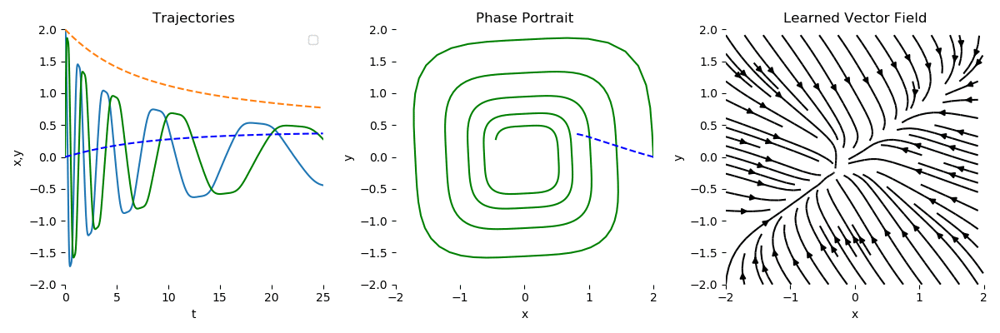

## Нейродифференциальные уравнения

Данный репозиторий содержит обзор на статью «Neural Ordinary Differential Equations», удостоенной награды за лучшую статью на конференции NeurIPS
2018. В обзоре описано, что такое нейродифференциальное уравнение, как его обучать, какие преимущества имеет данная модель по сравнению с обыч-
ными нейронными сетями и где может применяться на практике. 
Также в обзоре приведены результаты авторских экспериментов, код для которых также доступен.

1) review.pdf - текстовый обзор на статью. Автор приследовал цель рассказать о сути статьи как можно более понятно, стараясь сопровождать формальные выкладки некоторыми интуитивными соображениями. Тем не менее, в обзоре достаточно много математических формул (и даже присутсвуют доказательства), поэтому для понимания изложенного читателю, вероятно, понадобятся знания о нейронных сетях, а также некоторая осведомленность в математических дисциплинах.
2) В папке code:
	a) Tutorial_ODE.ipynb - небольшой ноутбук с примером обучения модели нейродифференциального уравнения на MNIST;
	b) odenet_experiment.ipynb - код для проведения оригинального эксперимента, результаты которого приведены в обзоре в разделе 4;
	c) utils.py - некоторые вспомогательные функции;
